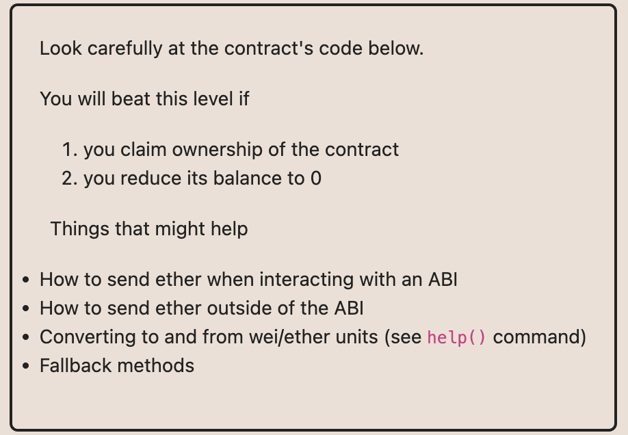
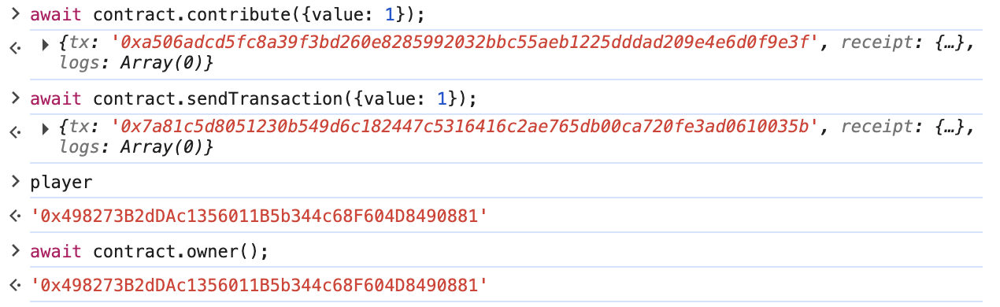
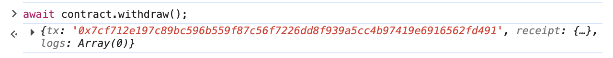
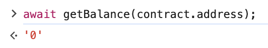
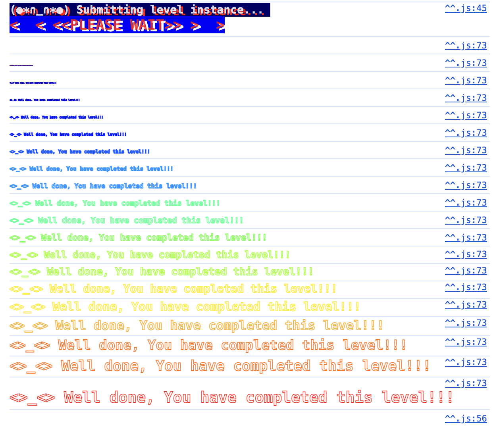

# 2. Fallback

문제의 조건은
- ownership 획득
- 잔고 0 만들기

먼저 코드에서 owner를 바꿀수 있는 부분은 2개가 있다.
`contribute`와 `receive`. 각각의 제약조건은 다음과 같다

- contribute: 0.001 ether보다 덜 보내고, `contributions[owner]`보다 `contributions[msg.sender]` 금액이 커야지 ownership 획득
- receive: 0보다 많이 보내고, `contributions[msg.sender]` 0보다 많아야 owner 획득

`contributions[owner]`는 1000 ether이기 때문에 contribute를 통해 0.001보다 작게 보내면서 해당 조건을 만족시키기는 매우 비효율적이다.

`contribute`와 `receive` 두 개를 체이닝하면
1. contribute를 통해 `contributions[msg.sender]`의 값을 0보다는 크게 만들 수 있고,
2. 그 뒤 0보다 큰 금액을 보내 `receive`를 태우면, `require(msg.value > 0 && contributions[msg.sender] > 0);`를 우회할 수 있다.

그러면 ownership을 획득할 수 있으니 이 후에 `withdraw`를 호출하면 `ownership 획득` + `잔고 0`을 도달할 수 있다.

