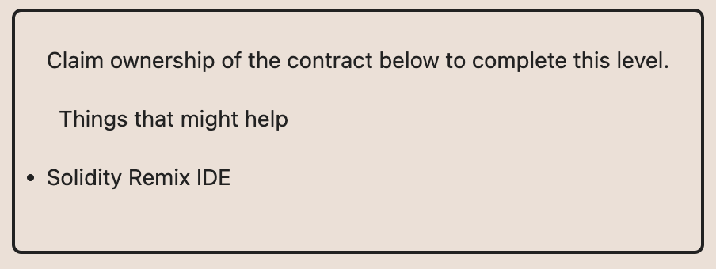
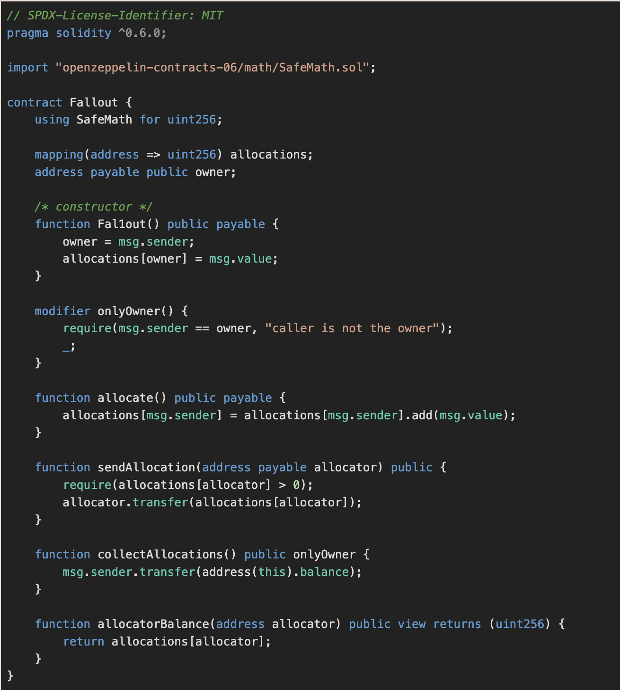
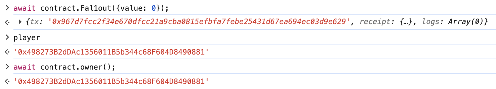
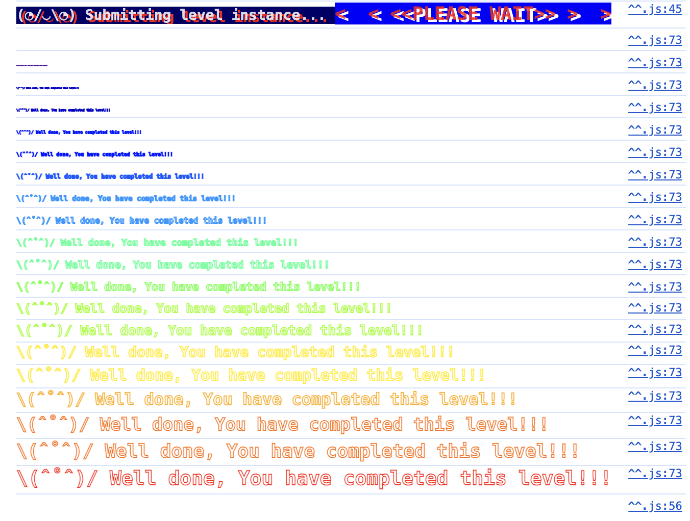

# 3. Fallout

문제의 조건은
- ownership 획득

ownership을 획득하기 위해 쓸 수 있는 함수를 살펴보면 owner 설정은 `constructor`로 주석처리 되어있는 `Fal1out` 함수에서만 할 수 있다.

다른 함수들에서는 단순히 자금 유치에 대한 기능만 하는것으로 보인다.

`Fal1out` 함수를 호출하는 것만으로 ownership을 얻을 수 있다.

