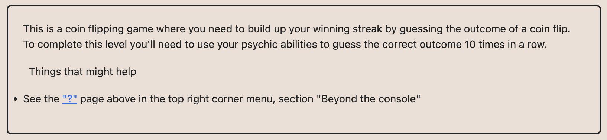
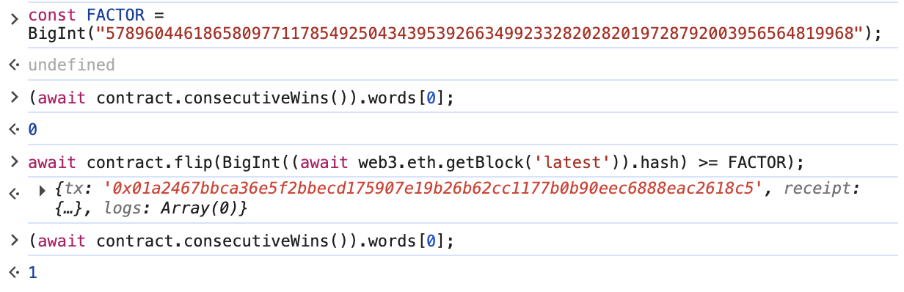
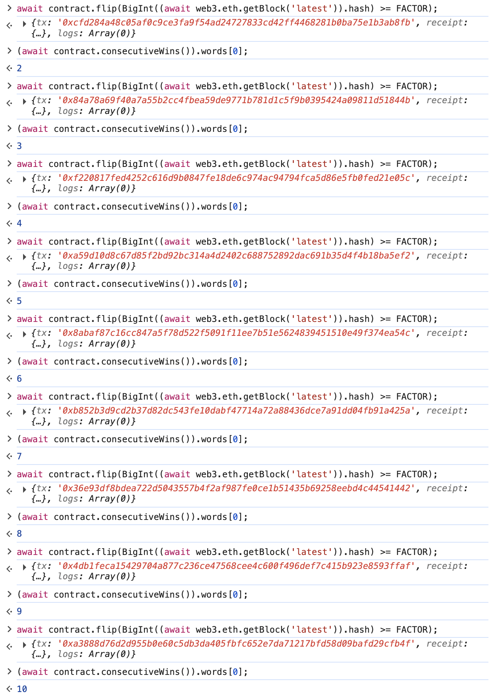
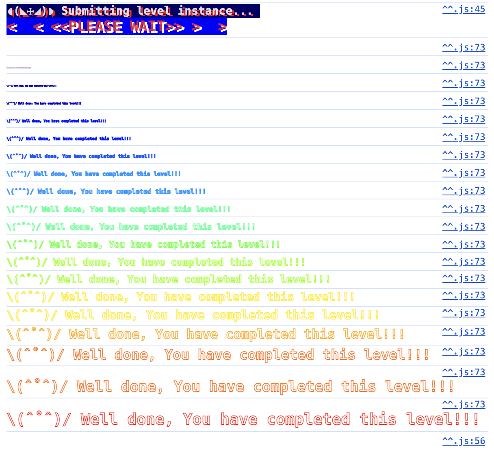

# 4. Coin Flip



문제의 조건은
- 10번의 coin flip을 한 번에 맞추기

```solidity
// SPDX-License-Identifier: MIT
pragma solidity ^0.8.0;

contract CoinFlip {
    uint256 public consecutiveWins;
    uint256 lastHash;
    uint256 FACTOR = 57896044618658097711785492504343953926634992332820282019728792003956564819968;

    constructor() {
        consecutiveWins = 0;
    }

    function flip(bool _guess) public returns (bool) {
        uint256 blockValue = uint256(blockhash(block.number - 1));

        if (lastHash == blockValue) {
            revert();
        }

        lastHash = blockValue;
        uint256 coinFlip = blockValue / FACTOR;
        bool side = coinFlip == 1 ? true : false;

        if (side == _guess) {
            consecutiveWins++;
            return true;
        } else {
            consecutiveWins = 0;
            return false;
        }
    }
}
```

코드는 위와 같다. `flip` 메소드에 `_guess` 값을 10번 맞추면 consecutiveWins가 10이 되고, 이 후 Submit을 하면 된다.

랜덤하게 시도하면 1/2**10(1/1024)의 기댓값을 갖고 있어서 브루트포싱으로도 풀 수 있는 문제지만 트랜잭션을 만드는데 시간이 너무 오래걸려 비효율적이다.

코드를 보면 blockValue 가 `uint256(blockhash(block.number -1))`를 통해 정해지는데 해당 값을 `57896044618658097711785492504343953926634992332820282019728792003956564819968 (0x8000000000000000000000000000000000000000000000000000000000000000)`로 나눠서 1인지 비교하는 로직이다.

최근 blockHash는 web3 라이브러리를 이용해 쉽게 구할 수 있는 부분이라 해당 값을 이용해서 `_guess`값을 계산해서 `FACTOR` 값 보다 크거나 같은지 비교하면 된다.





